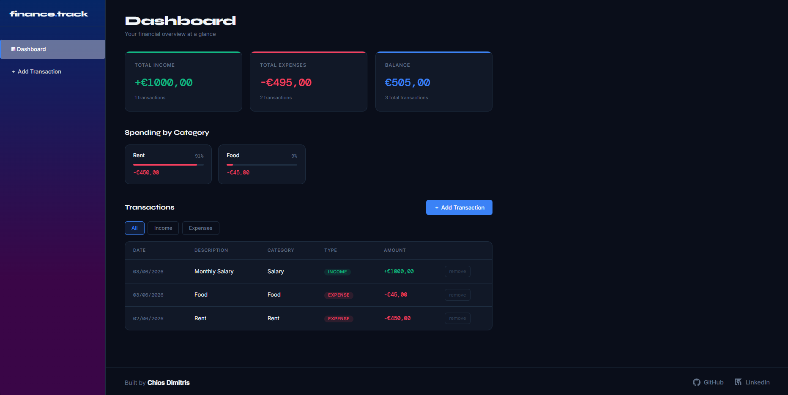

# 💰 Finance Tracker

A full-stack personal finance web application built with **Java Spring Boot** and **.NET Blazor WebAssembly**. Track income and expenses, visualise your balance, and break down spending by category — all from a clean, dark-themed dashboard.


---

## 📸 Screenshots

 


---

## ✨ Features

- **Transaction management** — add and delete income and expense entries
- **Live dashboard** — balance, total income and total expenses update instantly
- **Category breakdown** — visual progress bars showing spending per category
- **Filter by type** — view all, income-only, or expense-only transactions
- **Persistent storage** — data saved to a local H2 file database, survives restarts
- **European date format** — dates displayed as DD/MM/YYYY throughout
- **Responsive layout** — sidebar navigation, clean dark fintech theme

---

## 🏗️ Architecture

The project is split into two completely independent applications that communicate over HTTP:

```
┌─────────────────────┐         HTTP / REST          ┌──────────────────────────┐
│   .NET Blazor WASM  │  ──────────────────────────► │   Java Spring Boot API   │
│   localhost:5000    │ ◄──────────────────────────  │   localhost:8080         │
│                     │           JSON               │                          │
│  - Dashboard page   │                              │  - REST Controller       │
│  - Add Transaction  │                              │  - Service layer         │
│  - Filter / UI      │                              │  - JPA Repository        │
└─────────────────────┘                              │  - H2 File Database      │
                                                     └──────────────────────────┘
```

| Layer | Technology | Responsibility |
|---|---|---|
| Frontend | .NET 8 Blazor WebAssembly | UI, user interaction, API calls |
| Backend | Java 21 + Spring Boot 3 | Business logic, REST API |
| Persistence | H2 File Database + Spring Data JPA | Data storage |

---

## 🛠️ Tech Stack

### Backend — Java / Spring Boot
- **Spring Web** — REST API endpoints
- **Spring Data JPA** — database access without raw SQL
- **H2 Database** — embedded file-based database
- **Lombok** — reduces boilerplate (auto-generates getters, setters, constructors)
- **Hibernate ORM** — object-relational mapping

### Frontend — .NET / Blazor
- **Blazor WebAssembly** — C# running in the browser via WebAssembly
- **HttpClient** — typed HTTP calls to the Java API
- **Custom CSS** — dark fintech theme with CSS variables, no UI framework

---

## 🚀 Getting Started

### Prerequisites

| Tool | Version | Download |
|---|---|---|
| Java JDK | 21 | [adoptium.net](https://adoptium.net) |
| .NET SDK | 8 | [dotnet.microsoft.com](https://dotnet.microsoft.com/download) |
| VS Code | Latest | [code.visualstudio.com](https://code.visualstudio.com) |

### Run the backend

```bash
cd backend
./mvnw spring-boot:run
# Windows: bash mvnw spring-boot:run
```

API will be available at `http://localhost:8080`

### Run the frontend

```bash
cd frontend
dotnet run
```

Open the URL printed in the terminal (e.g. `http://localhost:5097`)

> Both must be running at the same time for the app to work.

---

## 📡 API Endpoints

Base URL: `http://localhost:8080/api/transactions`

| Method | Endpoint | Description |
|---|---|---|
| `GET` | `/` | Get all transactions (newest first) |
| `POST` | `/` | Create a new transaction |
| `DELETE` | `/{id}` | Delete a transaction by ID |
| `GET` | `/summary` | Get total income, expenses and balance |
| `GET` | `/categories` | Get expense totals grouped by category |

### Example request — create a transaction

```json
POST /api/transactions
Content-Type: application/json

{
  "description": "Monthly salary",
  "amount": 2500,
  "type": "INCOME",
  "category": "Salary",
  "date": "2026-06-03"
}
```

---

## 📁 Project Structure

```
finance-tracker/
├── backend/                        # Java Spring Boot API
│   └── src/main/java/com/financetracker/backend/
│       ├── config/CorsConfig.java          # Global CORS configuration
│       ├── controller/TransactionController.java
│       ├── model/Transaction.java
│       ├── repository/TransactionRepository.java
│       └── service/TransactionService.java
│
└── frontend/                       # .NET Blazor WebAssembly
    ├── Layout/
    │   ├── MainLayout.razor                # App shell + footer
    │   └── NavMenu.razor                   # Sidebar navigation
    ├── Models/Transaction.cs
    ├── Pages/
    │   ├── Home.razor                      # Dashboard
    │   └── AddTransaction.razor            # Add transaction form
    └── wwwroot/css/app.css                 # Custom dark theme
```

---

## 🔮 Possible Future Improvements

- [ ] Edit existing transactions
- [ ] Monthly summary chart (bar or line)
- [ ] CSV export
- [ ] Multiple accounts / wallets
- [ ] User authentication
- [ ] Deploy backend to Railway or Render, frontend to GitHub Pages

---

## 👤 Author

**Dimitrios Chios**

[](https://linkedin.com/in/dimitris-chios)

---

## 📄 License

This project is open source and available under the [MIT License](LICENSE).